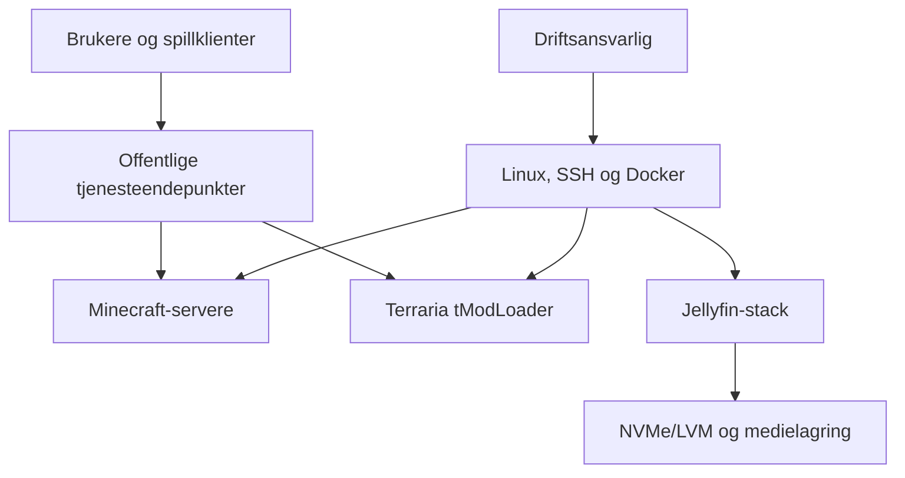

# Teknologiutvalget – infrastruktur og tjenester

Dette repositoryet dokumenterer arbeid utført for Teknologiutvalget: drift av spillservere, oppsett av en selvhostet medieserver, lagringsarbeid, Docker-baserte tjenester og vurdering av plattformer for videre tjenestedrift.

Målet er å vise både den tekniske løsningen og driftsarbeidet rundt den. Dokumentasjonen er skrevet på norsk, mens etablerte fagbegreper som `container`, `reverse proxy`, `deployment`, `backup` og `incident response` beholdes på engelsk.

## Hva prosjektet omfatter

- Drift og vedlikehold av flere Minecraft- og Terraria-servere.
- Versjonskontroll, oppdatering av modpacks og informasjon til brukerne i Discord.
- Ressursstyring ved å la tjenester kjøre etter behov fremfor at alt står på samtidig.
- Oppsett av Jellyfin på en egen Ubuntu-maskin med Docker og vedvarende lagring.
- Utvidelse av lagring med LVM og en egen 5 TB ext4-disk for mediefiler.
- Integrasjon mellom Jellyfin, Jellyseerr og Prowlarr.
- Vurdering av Proxmox som virtualiseringsplattform og en 8 TB Seagate Barracuda som serverlagring.
- Teknisk evaluering av Coolify for Git-basert `deployment` av webapplikasjoner og interne tjenester.
- Dokumentasjon av sikkerhet, vedlikehold, feilsøking og gjenoppretting.

## Dokumentert status

| Område | Status | Dokumentasjonsgrunnlag |
|---|---|---|
| Spillservere | Operativ drift dokumentert | Adresser, versjoner og status bekreftet 10. august 2026 |
| Jellyfin | Implementert oppsett dokumentert | Maskinvare, LVM, mounts og integrasjoner bekreftet i mars 2026 |
| Proxmox | Vurdert som plattform | 8 TB-disk og virtualiseringsbehov bekreftet; detaljert produksjonsinventar er ikke publisert |
| Coolify | Teknisk evaluering | Undersøkt som selvhostet PaaS; ingen produksjonssetting hevdes i dette repoet |

Se [STATUS.md](STATUS.md) for tjenestestatus og [docs/dokumentasjonsgrunnlag.md](docs/dokumentasjonsgrunnlag.md) for hvordan gjennomført arbeid skilles fra planlagte tiltak.

## Arkitektur på høyt nivå

Diagrammet er bevisst overordnet. Interne IP-adresser, credentials, private nøkler og detaljert nettverkstopologi hører ikke hjemme i et offentlig portfolio-repository.

## Repository-oversikt

| Område | Innhold |
|---|---|
| [`docs/`](docs/) | Arkitektur, historikk, sikkerhet, drift og tekniske valg |
| [`infrastructure/`](infrastructure/) | Proxmox-, nettverks- og lagringsdokumentasjon |
| [`services/`](services/) | Jellyfin, Coolify og spillservere |
| [`runbooks/`](runbooks/) | Praktiske prosedyrer for drift og hendelser |
| [`inventory/`](inventory/) | Maskinlesbar oversikt over publiserbare tjenester |
| [`scripts/`](scripts/) | Små, auditerbare hjelpescript for helsesjekk og publiseringskontroll |

## Viktige driftsprinsipper

1. En tjeneste skal være dokumentert før den regnes som driftsklar.
2. Data og konfigurasjon skal ligge på persistent storage, ikke bare inne i en container.
3. Oppdateringer tas én tjeneste om gangen og kontrolleres før neste endring.
4. Credentials og tokens lagres aldri i Git.
5. Status som deles med brukerne skal inneholde adresse, versjon, krav til klient og kjent nedetid.
6. Kapasitetsgrenser er en del av arkitekturen; ikke alle spillservere trenger å kjøre samtidig.

## Start her

- [Prosjektoversikt](docs/prosjektoversikt.md)
- [Teknisk arkitektur](docs/arkitektur.md)
- [Jellyfin og medieserver](docs/jellyfin-og-medieserver.md)
- [Spillservere](docs/spillservere.md)
- [Coolify-evaluering](docs/coolify-evaluering.md)
- [Drift og vedlikehold](docs/drift-og-vedlikehold.md)
- [Kompetanse og ansvar](docs/kompetanse-og-ansvar.md)

## Avgrensning

Repositoryet inneholder sanitert dokumentasjon og generelle runbooks. Det inneholder ikke originale secrets, komplette produksjonskonfigurasjoner, private adresser, brukerdata, mediefiler, world-data eller rå videotranskripsjoner brukt under teknologivurderingen.

