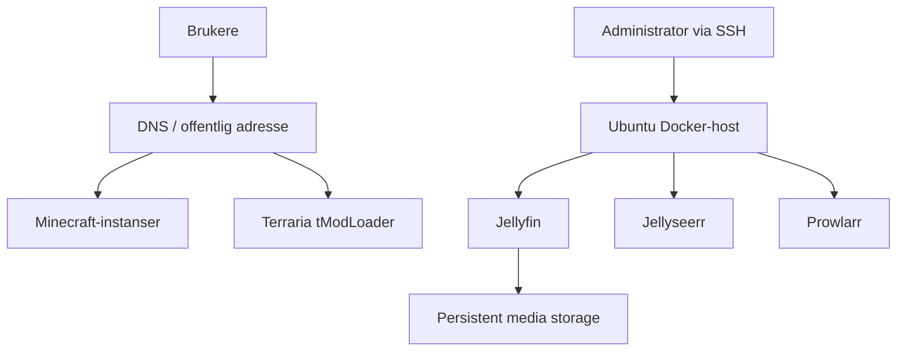
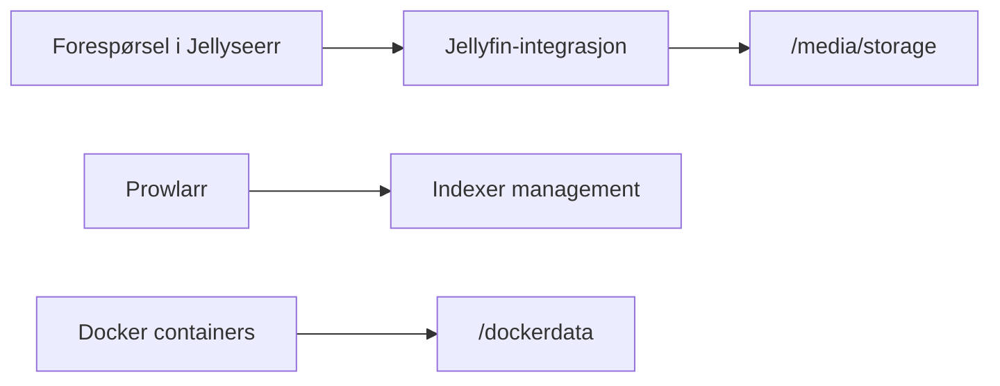
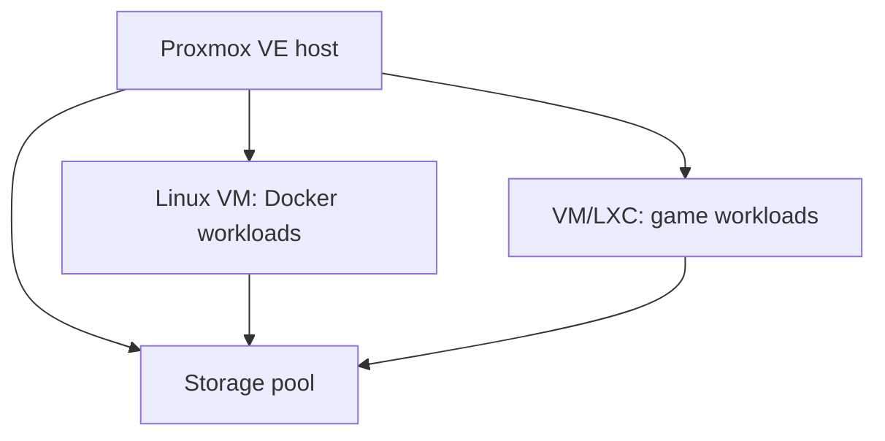

# Arkitektur

## Bekreftet driftsbilde

Den dokumenterte løsningen består av separate tjenestespor fremfor én monolittisk server:

- en dedikert Ubuntu/Docker-maskin for Jellyfin og medietjenester
- spillservere eksponert gjennom egne TCP-porter
- domenet `sky-net.no` brukt for Minecraft-endepunkter
- vedvarende lagring utenfor containerenes writable layer

Diagrammet viser logiske relasjoner. Det påstår ikke at alle tjenestene ligger på samme fysiske host eller nettverkssegment.

## Medieserverens dataflyt

Jellyseerr-integrasjonen og en kjørende Prowlarr-container er bekreftet. Automatisk nedlasting og hele `*arr`-kjeden er et utvidelsesspor, ikke dokumentert som komplett produksjonsflyt.

## Hvorfor separate lag

### Compute

Tjenestene kjøres som prosesser eller containers. Dette gjør det mulig å oppdatere og restarte én tjeneste uten å reinstallere hele hosten.

### Persistent storage

Konfigurasjon, cache og media bind-mountes fra hosten. En container kan dermed erstattes uten at bibliotek og konfigurasjon forsvinner.

### Network exposure

Kun nødvendige tjenesteporter skal eksponeres. Management-grensesnitt, SSH og hypervisor-administrasjon bør begrenses til betrodde nett eller VPN.

### Operations

Status, versjon og klientkrav dokumenteres separat fra selve tjenestekonfigurasjonen. Dette reduserer feil når brukerne skal koble til.

## Proxmox som målbilde

Proxmox ble vurdert for å isolere roller og gi en tydeligere grense mellom tjenester. Et fornuftig målbilde er vist under, men skal ikke leses som et komplett produksjonsinventar:

Før en slik migrering må CPU, RAM, disk, backup-target, bridge/VLAN og restore-test dokumenteres. En pfSense/router-rolle skal ikke blandes direkte med medieserveren; eventuell samlokalisering krever separate VMer og minst to fysiske nettverksgrensesnitt.

## Designvalg

| Valg | Begrunnelse |
|---|---|
| Docker for medietjenester | Reproduserbar oppstart og avhengighetsisolasjon |
| Host-baserte bind mounts | Data overlever container-recreation og er enklere å sikkerhetskopiere |
| Egen mediedisk | Skiller store mediefiler fra OS og applikasjonsdata |
| Flere spillporter | Separate instanser kan nås gjennom samme hostname |
| Manuell statusoversikt | Gir brukerne versjon og klientkrav, ikke bare «port åpen» |
| Kapasitetsstyrt oppstart | Ressurser brukes på serverne som faktisk er i bruk |

