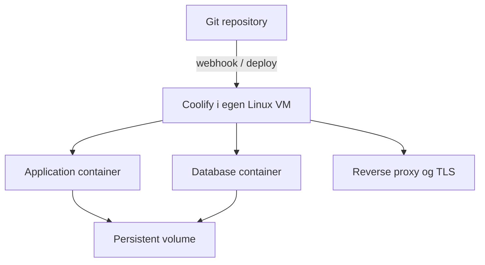

# Coolify-evaluering

## Status

Coolify er undersøkt som en mulig selvhostet Platform-as-a-Service for webapplikasjoner og interne tjenester. Denne dokumentasjonen hevder ikke at plattformen er satt i produksjon.

## Hvilket problem den kan løse

Tradisjonell selvhosting krever at hver applikasjon får sin egen manuelle prosess for build, container, reverse proxy, TLS, logs og secrets. Coolify samler mye av dette i ett management plane over Linux, Docker og SSH.

Aktuelle brukstilfeller for Teknologiutvalget:

- deploy av student- og kadettprosjekter fra Git
- statiske nettsider, API-er og full-stack-applikasjoner
- Dockerfile- og Docker Compose-baserte tjenester
- databaser med persistent storage
- automatisk redeploy ved Git-push
- sentral oversikt over status og logs

## Funksjoner som ble vurdert

| Funksjon | Relevans |
|---|---|
| Git-integrasjon og webhooks | Kortere vei fra commit til deployment |
| Docker image / Dockerfile / Compose | Støtter både enkle og sammensatte apper |
| Reverse proxy og TLS | Kan knytte custom domains til workloads |
| Environment variables og secrets | Skiller konfigurasjon fra source code |
| Persistent volumes | Nødvendig for databaser og stateful services |
| Logs og lifecycle controls | Start, stopp, restart og troubleshooting fra samme grensesnitt |
| Remote server via SSH | Ett kontrollpunkt kan administrere flere Linux-servere |
| Database- og service templates | Raskere oppstart, men krever fortsatt backup og hardening |

## Foreslått plassering

Coolify bør ligge i en egen Linux VM fremfor direkte på Proxmox-hosten. VM-en blir et tydelig sikkerhets- og feildomene, og det blir enklere å ta backup eller flytte plattformen.

## Sikkerhetsmessige konsekvenser

Coolify er et kraftig kontrollpunkt. En kompromittert konto eller SSH key kan gi tilgang til flere workloads.

Krav før produksjonsbruk:

- management UI kun gjennom begrenset tilgang og TLS
- MFA der løsningen støtter det
- unik SSH key per trust boundary, med plan for rotation
- ingen secrets i Git-repositoryet
- separate prosjekter og minst mulige rettigheter
- backup av Coolify-data, applikasjonsdata og databaser
- kontroll på hvilke porter som eksponeres
- dokumentert oppdaterings- og rollback-prosedyre

## Kapasitet

Det er ikke bare idle-forbruket til Coolify som teller. Image builds kan gi korte, høye topper i CPU, RAM og disk. Store eller samtidige builds bør flyttes til en separat build-server eller ferdigbygges i CI og pushes til et container registry.

Sizing skal gjøres mot gjeldende offisiell dokumentasjon og de faktiske applikasjonene. Tall fra enkeltvideoer brukes ikke som produksjonskrav.

## Anbefalt innføringsløp

1. Opprett en isolert test-VM.
2. Deploy en statisk demoapp fra et offentlig repo.
3. Legg til custom domain og TLS.
4. Test deploy fra privat repo uten å eksponere token.
5. Deploy en liten applikasjon med database og persistent volume.
6. Ta backup og gjennomfør restore til en ny VM.
7. Test oppgradering og rollback.
8. Først deretter vurderes produksjonsbruk for interne prosjekter.

## Beslutning

Coolify er relevant når målet er å gi flere prosjekter en felles, Git-basert deployment-flyt uten å kjøpe en separat managed plattform. Kostnaden flyttes imidlertid fra leverandørregning til egen drift. Patch management, overvåking, backup og incident response forsvinner ikke.

