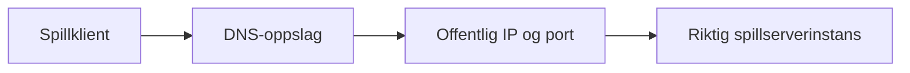

# Nettverk og domener

## Offentlige endepunkter

Minecraft-tjenestene bruker ett hostname og separate TCP-porter:

| Tjeneste | DNS / adresse | Port |
|---|---|---:|
| Minecraft – Optimalisert | `mc.sky-net.no` | `25567` |
| Minecraft – All The Mods 10 | `mc.sky-net.no` | `25568` |
| Minecraft – Cobbleverse | `mc.sky-net.no` | `25572` |
| Terraria – Modded | `65.21.209.174` | `7779` |

Dette er brukerrettede adresser. Management-endepunkter er bevisst ikke publisert.

## Trafikkflyt



DNS peker til en adresse; porten skiller instansene. En vanlig HTTP reverse proxy er ikke automatisk en proxy for Minecraft- eller Terraria-trafikk. TCP/UDP-proxying må i så fall konfigureres eksplisitt og testes med riktig protokoll.

## Prinsipper

- eksponer bare porter som har en aktiv tjeneste
- begrens SSH og management til betrodde kilder eller VPN
- dokumenter retning, protokoll og formål for hver firewall-regel
- behold intern navngivning og topologi utenfor offentlig dokumentasjon
- bruk TLS på webtjenester og administrasjonsgrensesnitt
- logg endringer i DNS og port-forwarding

## DNS og endringer

Ved endring av offentlig IP:

1. registrer eksisterende DNS-verdi og TTL
2. oppdater DNS
3. kontroller propagasjon fra mer enn én resolver
4. test tjenesten med faktisk klient
5. behold gammel forwarding kortvarig dersom migreringen tillater det
6. oppdater statusmelding og dokumentasjon

Eksempel på kontroll:

```bash
dig +short mc.sky-net.no
```

## Webapplikasjoner

Hvis Coolify tas i bruk, bør webapplikasjoner få egne subdomains og TLS-sertifikater. Wildcard DNS kan forenkle onboarding, men må kombineres med kontroll på hvilke applikasjoner som får publiseres. Secrets, databaser og management UI skal ikke bli offentlig bare fordi DNS er enkelt å opprette.

